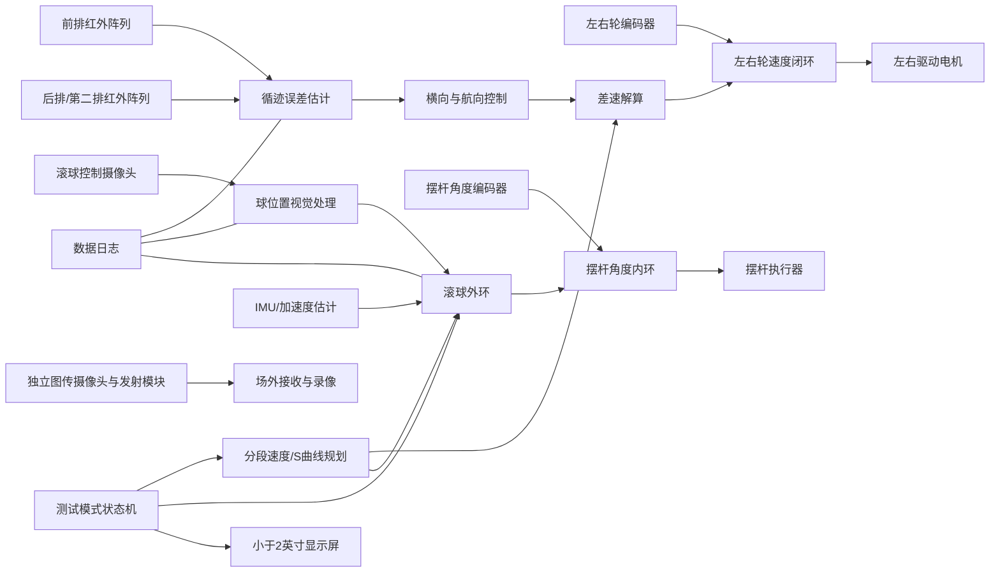
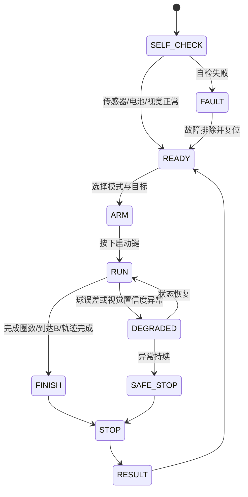

下面是完整 Markdown 内容，复制代码块内的全部文本，新建 `.md` 文件后粘贴即可。内容依据赛题的任务、功能评分、结构限制和报告评分要求编排。  

```markdown
# 2026 电赛 H 题：车载平衡滚球运动控制系统——冲击高名次总体方案与执行框架

> 版本：V1.0  
> 定位：团队唯一主线方案、任务拆解依据、联调顺序与验收标准  
> 原则：**先拿稳基础分，再逐级解锁 20 分大项；以可靠性、可重复性和工程完整度取胜。**

---

## 0. 队长决策摘要

### 0.1 我们的主方案

采用“**双闭环小车 + 视觉滚球闭环 + 车辆加速度前馈 + 任务状态机**”的分层架构：

1. **小车**：两轮差速驱动，双排红外阵列估计横向偏差与航向偏差，编码器速度闭环，按赛道分段进行速度规划。
2. **摆杆**：右端高速低回差执行器驱动，铰链端安装独立角度传感器，构成摆杆角度内环。
3. **钢球检测**：摄像头俯视凹槽，受控照明，采用 ROI、背景差分/梯度投影、连通域与时序预测融合，输出钢球位置与置信度。
4. **滚球控制**：外环采用“状态反馈/LQR 或 PD+积分”控制，叠加车辆纵向加速度前馈和参考轨迹前馈。
5. **车球协同**：小车速度使用限加速度、限加加速度的 S 曲线；球误差变大时只降低车速，不削弱循迹转向控制。
6. **图传**：控制视觉与评审图传尽量解耦。主方案使用独立控制摄像头和独立低延迟图传摄像头；如现场规则要求单摄像头，则切换单摄像头共享方案。
7. **软件**：明确测试模式、状态机、异常降级、日志记录和参数版本管理，避免临场“改一处崩全局”。

### 0.2 关键取胜点

- 不把时间浪费在“极限速度”上。赛道周长约为：

\[
2\times1.5+2\pi\times0.5\approx6.14\text{ m}
\]

20 s 只需约 0.31 m/s 平均速度，30 s 只需约 0.205 m/s。真正难点是**加减速扰动下钢球全程误差不超过 1 cm**。

- 将车辆加速度视为滚球系统的主要外扰，必须做前馈补偿，而不是只靠位置 PID 硬扛。
- 将静态滚球任务做成“轨迹跟踪”，不是目标点阶跃；通过 S 曲线主动抑制超调。
- A 点停车采用“**前置减速门 + 基准点低速门 + 主动刹车**”两级策略，不依赖一次性高速刹停。
- 每个高分任务都设置内部裕量，正式验收目标不贴线：
  - 20 s 任务内部目标：≤17 s；
  - 30 s 任务内部目标：≤25 s；
  - 球位置最大误差内部目标：≤0.7～0.8 cm；
  - 停车偏差内部目标：≤1 cm。

---

# 1. 赛题硬约束与得分拆解

## 1.1 赛题核心任务

系统由循线小车、25 cm 凹槽摆杆、摆杆控制机构、钢球和图传装置组成。摆杆一端固定，固定点距离小车平板高度不小于 5 cm，另一端由机构控制倾角。

| 项目 | 关键要求 | 分值 | 我们的内部验收目标 |
|---|---:|---:|---:|
| 图传 | 实时稳定显示、完整录像、可回放 | 6 | 连续 5 次测试无明显断流，画面覆盖全摆杆 |
| 小车一圈停车 | 一圈 ≤20 s，A 点停车偏差 ≤2 cm | 16 | ≤17 s，停车偏差 ≤1 cm，10 次成功率 ≥90% |
| 静态滚球 | O→+5 cm→-5 cm 并稳定，总时间 ≤5 s，目标误差 ≤1 cm | 13 | ≤4.2 s，最终误差 ≤0.5 cm |
| A 到 B 动态平衡 | AB ≤8 s，球在 O 附近，误差 ≤1 cm | 20 | ≤6.5 s，最大误差 ≤0.8 cm |
| 一圈中心平衡 | 一圈 ≤30 s，球在 O 附近，误差 ≤1 cm | 20 | ≤25 s，最大误差 ≤0.8 cm |
| 一圈任意位置平衡 | 一圈 ≤30 s，球在任意指定位置，误差 ≤1 cm | 20 | 支持 -9～+9 cm，最大误差 ≤0.8 cm |
| 其他 | 工艺、创新、完整性等 | 5 | 自检、日志、模块化、低电压保护、规范布线 |
| 报告 | 方案、理论、电路程序、测试、规范性 | 20 | 从第一天同步积累图、表、数据，不在最后补写 |

## 1.2 必须严格遵守的结构与规则

- 车身长宽不超过 35 cm × 25 cm。
- 必须使用轮式驱动和车载电池。
- 循迹模块只能使用红外光电模块，数量不限。
- 必须有启动按键和不大于 2 英寸的显示装置。
- 钢球位置检测必须采用摄像头。
- 摆杆使用 25 cm 的 4 分 PPR 水管改造，槽内不能做增摩擦或凹坑处理。
- 赛道黑线宽 1.8±0.2 cm，直线段 1.5 m，圆弧半径 0.5 m。
- A 点有一条与环线垂直、长度 5 cm 的黑色启停线。
- 小车投影不能完全脱离轨迹线。
- 行驶中不得遥控或人为干预。
- 图传接收、显示、存储装置需要与作品一起封存。

## 1.3 题面未明确、必须按工程假设处理的事项

以下内容题面没有给出精确定义，不能假装题目已经规定：

1. “稳定”需要持续多长时间没有明确给出。内部统一按**连续 0.8～1.0 s 保持在误差带内**验收。
2. “任意指定位置”的指定范围和现场输入方式没有明确给出。系统应支持至少 -9 cm 到 +9 cm，步进 0.1 cm，并预留快速设定界面。
3. 是否允许控制视觉与图传使用两颗摄像头没有明确写明。主方案使用双摄像头解耦；若现场答疑要求单摄像头，立即切换共享方案。
4. 测试时是否要求通过 A 后立即停车没有明确写在第 5、6 项中。我们的状态机通过 A 后记录完成，再平滑停车，避免冲出场地。

---

# 2. 总体系统架构



## 2.1 控制层级

| 层级 | 典型频率 | 主要功能 |
|---|---:|---|
| 电机/摆杆快速内环 | 500～1000 Hz | 轮速、摆杆角度、执行器保护 |
| 红外采样与循迹控制 | 500～1000 Hz | 黑线位置、航向误差、转向控制 |
| 视觉球位输出 | 80～160 Hz | 钢球位置、置信度、时间戳 |
| 滚球位置外环 | 100～200 Hz | 位置、速度估计，倾角命令 |
| 状态机与安全管理 | 100 Hz | 模式切换、圈数、异常降速 |
| 显示与人机界面 | 10～20 Hz | 模式、目标、时间、电量、状态 |
| 日志 | 100 Hz 左右 | 为调参和报告提供完整数据 |

## 2.2 架构原则

- 实时控制与图传录像相互独立，图传卡顿不能影响控制。
- 小车转向和球位置控制相互独立，但小车**速度规划**接受滚球安全管理器约束。
- 所有传感数据带时间戳，避免视觉延迟被误认为当前状态。
- 所有参数集中存放，禁止散落在代码中。
- 每种测试模式有独立参数集，但共享同一底层驱动和状态机。

---

# 3. 机械系统设计

## 3.1 小车底盘

### 主方案

- 两个带编码器的直流减速电机同轴差速驱动。
- 一个低阻力万向轮或球轮作为第三支撑点，形成三点稳定支撑。
- 驱动轮轴尽量接近整车质心，电池放在最低层。
- 车宽建议 20～23 cm，车长建议 29～33 cm，留足 35×25 cm 边界裕量。
- 摆杆沿小车纵向中心线布置，减小左右转弯时对球纵向运动的耦合。
- 轮胎做动平衡，左右轮直径配对，避免速度闭环仍然出现周期扰动。
- 所有重件低置，摄像头支架与摆杆支架采用刚性框架，不使用过软悬臂。

### 不采用的方案

- 不建议四轮滑移转向：弯道摩擦和车身振动大，容易干扰滚球。
- 不建议重型单板计算机放在高处：增加重心、功耗和启动风险。
- 不建议完全无编码器开环驱动：电池电压和地面摩擦变化会破坏停车精度。

## 3.2 摆杆机构

### 摆杆本体

- 严格按题目使用 25 cm PPR 管改造。
- 槽内表面保持原状和平滑，不贴胶带、不喷涂、不打磨出增摩擦纹理。
- 刻度或视觉标记只放在槽边沿或外侧，不放入凹槽。
- 两端增加不接触正常运动区的防滚落挡片。
- 固定铰链采用双支点轴承或精密合页，消除左右晃动。
- 固定点高度建议 6～8 cm，满足不低于 5 cm，同时给右端执行器留空间。

### 执行器主方案

- 右端使用高速、低回差数字执行器，通过短连杆驱动。
- 铰链轴上安装独立磁编码器或绝对角度传感器，不能只相信执行器内部位置命令。
- 使用轻微预紧弹簧或配重抵消摆杆自重，降低执行器持续负载与齿隙影响。
- 连杆两端使用球头，避免装配偏差导致卡滞。
- 软件倾角限制建议 ±6°～±8°，机械限位建议 ±10° 左右。

### 备选方案

- 主执行器故障：替换同型号备用执行器，保持连杆尺寸不变。
- 角度传感器故障：临时切换“命令角度—实测角度标定表”，但只作为保底。
- 回差过大：增加单向弹簧预载，并降低滚球外环带宽。

## 3.3 摄像头与照明支架

- 控制摄像头固定在车体刚性门架上，垂直俯视整个摆杆。
- 使用遮光罩隔离赛场照明变化。
- 使用均匀漫射 LED 灯带，曝光和白平衡固定，禁止自动曝光在测试过程中跳变。
- 镜头视野只需覆盖 25 cm 摆杆及少量边缘，尽可能提高每厘米像素数。
- 线缆固定，不能在摆杆运动范围内摆动。
- 图传摄像头放置在不遮挡控制摄像头的位置，画面必须能看清钢球和刻度。

---

# 4. 电控硬件方案

## 4.1 推荐分工架构

### 运动控制主控

承担：

- 左右轮编码器采集与速度闭环；
- 红外阵列采样；
- 摆杆角度内环；
- IMU 读取；
- 测试状态机；
- 计时、显示、日志和安全保护。

要求：

- 有足够 ADC、定时器、编码器接口、DMA、串口/CAN；
- 控制周期稳定；
- 能保存多套参数；
- 有硬件看门狗。

### 视觉处理单元

承担：

- 摄像头采集；
- ROI 截取；
- 球位置识别；
- 位置滤波或初级跟踪；
- 通过 UART/CAN 输出：`时间戳、位置、置信度、帧号`。

不建议将视频编码、无线传输和实时控制全部塞进同一处理器。

## 4.2 传感器与执行器

| 模块 | 主方案要求 |
|---|---|
| 红外循迹 | 前后两排阵列，每排 8～16 点；独立校准、归一化 |
| 轮速 | 左右轮正交编码器，能够在低速阶段稳定测速 |
| 摆杆角度 | 铰链轴绝对角度传感器，分辨率优于 0.1° |
| 车辆扰动 | 六轴 IMU；同时使用目标轮速微分作为加速度前馈 |
| 球位置 | 摄像头，建议高帧率、小 ROI、固定曝光 |
| 电机驱动 | 支持正反转、主动刹车、过流保护和电流采样 |
| 显示 | 1.3～1.8 英寸 OLED/TFT，确保小于 2 英寸 |
| 输入 | 启动键、模式键、目标位置调节旋钮或按键 |
| 存储 | SD 卡或高速串口日志，至少保留关键测试记录 |
| 图传 | 独立低延迟发送、接收和录像链路 |

## 4.3 电源与抗干扰

建议至少分为四路：

1. 电机电源；
2. 摆杆执行器电源；
3. 数字控制与传感器电源；
4. 图传电源。

必须做到：

- 星形接地；
- 电机和执行器端就近大电容；
- 数字电源前加 LC/磁珠和稳压；
- 图传单独滤波，避免画面横纹；
- 电池电压在线测量；
- 电机驱动、执行器和主控有保险或限流；
- 所有连接器加锁扣并贴标签；
- 备用电池在相同电压和重量条件下做过整车验证。

---

# 5. 小车循迹与停车控制

## 5.1 双排红外阵列布局

使用两排沿车体横向布置的红外阵列，前后间距建议 60～100 mm。

对每排传感器做白底、黑线标定，将采样归一化到 0～1。用加权质心求线位置：

\[
s=\frac{\sum_i w_i q_i}{\sum_i q_i}
\]

其中 \(q_i\) 是黑线响应，\(w_i\) 是传感器横向坐标。

前后排分别得到 \(e_f,e_r\)，则：

\[
e_y \approx \frac{e_f+e_r}{2}
\]

\[
e_\psi \approx \arctan\left(\frac{e_f-e_r}{L_s}\right)
\]

其中 \(L_s\) 为两排阵列纵向距离。这样能同时得到横向误差和航向误差，比单排 PID 高速时更稳定。

## 5.2 转向控制

主控制律：

\[
\omega_{cmd}=k_y(v)e_y+k_\psi(v)e_\psi+k_i\int e_y\,dt+\omega_{ff}
\]

- 增益随车速调度；
- 直线与弯道使用不同参数；
- \(\omega_{ff}\) 可由赛道分段状态提供曲率前馈；
- 误差较大时先降低线速度，不激进放大转向；
- 转向输出做限幅和变化率限制，避免车体抖动。

左右轮目标速度：

\[
v_R=v+\frac{B}{2}\omega_{cmd},\qquad
v_L=v-\frac{B}{2}\omega_{cmd}
\]

\[
\omega_R=\frac{v_R}{r},\qquad
\omega_L=\frac{v_L}{r}
\]

其中 \(B\) 为轮距，\(r\) 为轮半径。

## 5.3 轮速闭环

每个轮子使用独立 PI：

\[
u=K_p(\omega^*-\omega)+K_i\int(\omega^*-\omega)dt+u_{ff}
\]

前馈包含速度项和加速度项：

\[
u_{ff}=k_v\omega^*+k_a\dot{\omega}^*
\]

附加：

- 电池电压补偿；
- 输出饱和与积分抗饱和；
- 低速死区补偿；
- 左右轮独立参数；
- 主动刹车功能。

## 5.4 速度规划

不要使用瞬间阶跃速度。统一使用限加速度、限加加速度 S 曲线。

### 建议初始参数

| 模式 | 直线速度 | 弯道速度 | 最大加速度 | 目标时间 |
|---|---:|---:|---:|---:|
| 小车一圈停车 | 0.42～0.48 m/s | 0.30～0.36 m/s | 0.7～1.0 m/s² | 14～17 s |
| AB 动态平衡 | 0.28～0.35 m/s | 不涉及完整弯道 | 0.35～0.55 m/s² | 5～6.5 s |
| 一圈中心/任意点 | 0.26～0.32 m/s | 0.22～0.28 m/s | 0.3～0.5 m/s² | 21～25 s |

最终参数必须通过实测确认，不能照抄。

## 5.5 A 点识别与精准停车

A 点启停线与主线垂直，适合使用“左右门传感器”识别：

- 在车体同一横截面布置左右两个红外点，正常沿主线行驶时二者位于白底；
- 经过横向启停线时，左右点同时看到黑色；
- 设两组门传感器：
  1. 前置门：触发减速；
  2. 基准门：与车体唯一测试点同一纵向位置，低速触发最终刹车。

### 停车流程

1. 起步时记录 A 线，但状态机不允许它触发停车。
2. 通过里程、弯道状态和最短运行时间完成“整圈已完成”解锁。
3. 前置门再次检测到 A 线：降速至 0.04～0.07 m/s。
4. 基准门检测到 A 线：主动刹车，进入位置保持。
5. 若编码器显示继续滑移，给出短时反向制动。
6. 显示最终时间和停车状态。

### 防误触发条件

A 线停车事件必须同时满足：

- 已通过直线、弯道、直线、弯道的完整状态序列；
- 里程超过约 5 m；
- 运行时间超过合理最小值；
- 左右门同时黑；
- 连续多次采样确认。

---

# 6. 钢球视觉检测

## 6.1 视觉指标

内部目标：

- 位置输出频率：≥100 Hz；
- 静态位置误差：≤0.2～0.3 cm；
- 完整测量链路延迟：≤15 ms；
- 短时漏检：连续不超过 2～3 帧；
- 输出置信度和时间戳。

## 6.2 成像设计优先于算法复杂度

先解决光学，再写算法：

- 固定曝光、固定增益；
- 漫射照明；
- 遮光罩；
- 摄像头与摆杆几何关系固定；
- 球和凹槽在画面中占据尽可能多的像素；
- 画面只处理狭长 ROI；
- 所有反光线缆和亮色螺丝移出 ROI。

## 6.3 推荐算法

### 初始化

1. 获取摆杆左右边界或端点；
2. 确定中心点 O；
3. 建立像素到厘米映射；
4. 记录无球区域的静态背景特征；
5. 检查当前照明和曝光是否在允许范围。

### 每帧处理

1. 截取摆杆 ROI；
2. 灰度化并做轻量滤波；
3. 计算背景差分、列方向梯度能量和局部方差；
4. 沿摆杆长度方向形成一维得分曲线；
5. 在预测位置附近优先搜索；
6. 用连通域面积、宽度、圆度或峰值比筛选候选；
7. 对峰值做加权质心或抛物线拟合，得到亚像素位置；
8. 输出位置、置信度、帧号和时间戳。

### 位置映射

若左右标定点像素为 \(p_L,p_R\)，摆杆有效长度为 25 cm，则：

\[
x=25\cdot\frac{p-p_L}{p_R-p_L}-12.5
\]

中心 O 对应 \(x=0\)。

### 不建议的做法

- 不把霍夫圆作为唯一实时算法，计算量和反光敏感性较高；
- 不使用自动曝光；
- 不使用深度学习作为主方案；
- 不仅凭单帧二值化，不做时序约束；
- 不通过修改钢球表面来提高识别度。

## 6.4 时序滤波与速度估计

使用 α-β 滤波或卡尔曼滤波估计 \([x,\dot{x}]\)。

状态模型：

\[
\begin{bmatrix}
x_{k+1}\\
\dot{x}_{k+1}
\end{bmatrix}
=
\begin{bmatrix}
1&T\\
0&1
\end{bmatrix}
\begin{bmatrix}
x_k\\
\dot{x}_k
\end{bmatrix}
+
\begin{bmatrix}
T^2/2\\
T
\end{bmatrix}a_k
\]

测量：

\[
z_k=x_k+n_k
\]

滤波器要使用实际帧时间戳，不假设帧间隔恒定。

### 置信度降级

- 置信度低但未超 50 ms：使用模型短时预测；
- 超过 50～100 ms：降低车速、限制摆杆动作；
- 超过 100～150 ms：平滑停车并将摆杆回到安全角度；
- 不能在失去视觉时继续高速运行。

---

# 7. 滚球动力学与控制

## 7.1 简化动力学

设球沿摆杆坐标为 \(x\)，摆杆角度为 \(\theta\)，小车纵向加速度为 \(a_c\)。

小角度下可写为：

\[
\ddot{x}=K_\theta\theta-K_a a_c-c\dot{x}+d
\]

其中：

- \(K_\theta\) 表示重力经摆杆倾角作用到球的等效系数；
- 对理想实心球滚动，系数与 \(5g/7\) 同量级，但实际凹槽双接触会改变参数；
- \(K_a\) 表示车辆纵向加速度耦合；
- \(c\) 为等效阻尼；
- \(d\) 为摩擦、轨道不平和模型误差。

**所有参数必须通过实物辨识，不能直接使用理想值。**

## 7.2 双闭环结构

### 摆杆角度内环

目标：让实测角度快速跟踪 \(\theta_{cmd}\)。

控制可用 PID/状态反馈：

\[
u_\theta=K_{p\theta}e_\theta+K_{i\theta}\int e_\theta dt+K_{d\theta}\dot e_\theta
\]

目标指标：

- 带宽约 15～25 Hz；
- 小角度阶跃无明显回差；
- 0.1° 级重复性；
- 饱和和速率限制；
- 执行器电流与温度保护。

### 钢球位置外环

定义：

\[
e=x_{ref}-x
\]

主控制律可先用：

\[
\theta_{cmd}
=
\theta_{ff}
+K_p e
+K_d(\dot{x}_{ref}-\dot{x})
+K_i\int e\,dt
\]

其中前馈：

\[
\theta_{ff}
=
\frac{
\ddot{x}_{ref}
+K_a a_c
+c\dot{x}_{ref}
}{
K_\theta
}
\]

也可以将位置、速度和积分状态组成增广模型，使用离散 LQR。比赛时间有限时，优先选择“可解释、容易调、能记录”的状态反馈，不上复杂 MPC。

### 控制细节

- 位置外环带宽建议 2.5～4 Hz；
- 速度估计必须滤波；
- 角度命令限幅；
- 积分抗饱和；
- 球接近端点时缩小允许角度；
- 对正负方向分别补偿静摩擦和执行器回差；
- 直线、弯道可保留小的分段偏置表。

## 7.3 车辆加速度前馈

滚球全程误差能否压到 1 cm 内，关键在于 \(a_c\) 的估计。

使用三路信息融合：

1. **速度规划器的目标加速度**：最平滑、提前已知，是主前馈；
2. **编码器速度微分**：反映真实纵向加速度，但需低通滤波；
3. **IMU 纵向加速度**：用于修正打滑和坡度影响，但要去除零偏和振动。

建议：

\[
a_c=w_1a_{ref}+w_2a_{enc}+w_3a_{imu}
\]

初期可先仅用 \(a_{ref}\)，待基础控制稳定后再加入编码器和 IMU 修正。

## 7.4 静态 O→+5→-5 任务轨迹

不要直接将参考从 0 跳到 +5 cm，再跳到 -5 cm。

推荐轨迹：

- 0→+5 cm：1.0～1.3 s 的五次多项式或 S 曲线；
- 在 +5 cm 保持 0.2～0.4 s，确认“到达”；
- +5→-5 cm：1.6～2.0 s 的 S 曲线；
- 剩余时间用于稳定；
- 总完成目标 3.8～4.2 s。

五次轨迹满足位置、速度、加速度端点连续：

\[
x_r(t)=x_0+(x_f-x_0)(10s^3-15s^4+6s^5),\quad s=t/T
\]

由轨迹直接计算 \(\dot{x}_r,\ddot{x}_r\)，用于前馈。

## 7.5 任意目标位置

- 上电菜单选择“任意点模式”；
- 旋钮或按键以 0.1 cm 调整；
- 显示目标位置；
- 按启动后锁定目标，运行过程中不能远程修改；
- 软件范围建议 -9～+9 cm；
- 目标靠近端部时降低最大速度和最大倾角；
- 在目标点重新执行积分偏置学习，消除静态误差。

---

# 8. 车球协同控制

## 8.1 核心思想

转向控制负责“不掉线”，速度控制负责“不给球制造过大扰动”。

滚球安全管理器根据球误差和置信度调整车辆速度上限：

| 条件 | 动作 |
|---|---|
| \(|e_x|<0.4\) cm 且置信度高 | 按计划速度运行 |
| 0.4～0.7 cm | 限制加速度和加加速度 |
| 0.7～0.9 cm | 降低线速度，不削弱转向 |
| 接近 1 cm | 保持转向，快速但平滑减速 |
| 视觉长时间失效 | 平滑停车、摆杆回安全角度 |

这样可以在 30 s 的宽裕时间内优先保住 20 分。

## 8.2 弯道处理

摆杆沿车体纵向布置时，理想向心加速度主要沿横向，直接造成球纵向运动的分量较小。但实际存在：

- 车体侧倾；
- 驱动轮速度不一致；
- 弯道入口、出口的纵向速度变化；
- 摆杆安装偏角；
- 球与槽壁双接触产生的耦合。

因此：

- 弯道速度低于直线；
- 入弯和出弯使用平滑速度过渡；
- 允许设置“顺时针左/右弯偏置参数”；
- 通过日志比较直线与弯道误差，不能凭感觉调参。

## 8.3 高分策略

- 第 4 项只要求 A 到 B，目标时间 5～6.5 s，留出约 1.5 s 以上裕量给球控制。
- 第 5、6 项目标一圈 21～25 s，不追求 15 s。
- 只有第 2 项使用高速参数集。
- 每个模式单独保存速度、加速度、循迹和滚球参数，不用一套参数硬覆盖所有任务。

---

# 9. 测试模式状态机

## 9.1 模式菜单

建议界面：

- M1：图传检查；
- M2：小车一圈并停车；
- M3：静态 O→+5→-5；
- M4：A→B 中心平衡；
- M5：一圈中心平衡；
- M6：一圈任意点平衡；
- M7：传感器标定；
- M8：执行器与电机自检。

显示内容：

- 当前模式；
- 球目标位置；
- 实际球位置；
- 视觉置信度；
- 电池电压；
- 测试时间；
- 故障代码。

## 9.2 通用状态机



## 9.3 启动同步

按下启动键时必须在同一时刻：

- 清零计时；
- 清零圈数和里程；
- 锁定目标位置；
- 记录初始球位置；
- 使能电机和摆杆控制；
- 写入日志起始标志；
- 更新显示。

避免计时、日志和控制起点不一致。

---

# 10. 软件工程框架

## 10.1 模块划分

```text
firmware/
├─ bsp/                  # ADC、PWM、编码器、UART、显示、SD、IMU
├─ drivers/
│  ├─ line_sensor/
│  ├─ wheel_encoder/
│  ├─ motor_driver/
│  ├─ beam_encoder/
│  ├─ vision_link/
│  └─ display/
├─ control/
│  ├─ wheel_speed_pi/
│  ├─ line_controller/
│  ├─ speed_profile/
│  ├─ beam_angle_loop/
│  ├─ ball_observer/
│  ├─ ball_controller/
│  └─ safety_governor/
├─ app/
│  ├─ mode_manager/
│  ├─ lap_detector/
│  ├─ stop_line/
│  ├─ self_test/
│  └─ ui/
├─ config/
│  ├─ vehicle_params.h
│  ├─ mode_params.h
│  └─ calibration_data.h
└─ logging/
   ├─ logger/
   └─ telemetry/
vision/
├─ camera/
├─ roi_calibration/
├─ ball_detector/
├─ tracker/
└─ protocol/
```

## 10.2 调度建议

- 定时器中断只做采样、控制计算和必要输出；
- 视觉数据接收使用 DMA；
- 显示和 SD 写入放在低优先级任务；
- 日志采用环形缓冲，避免写卡阻塞控制；
- 所有通信有 CRC、帧号和超时；
- 看门狗由多个关键任务共同喂狗；
- 任何异常不得进入死循环等待。

## 10.3 视觉通信协议示例

```text
Header | FrameID | Timestamp_us | Position_0.01mm | Confidence | Status | CRC
```

- 位置使用整数定点数；
- 主控使用视觉时间戳做延迟补偿；
- `Status` 区分正常、低置信度、越界、标定失败。

## 10.4 日志字段

至少记录：

```text
time_ms
mode
state
ball_x_cm
ball_ref_cm
ball_v_cm_s
vision_conf
beam_angle_cmd_deg
beam_angle_meas_deg
car_v_ref_m_s
car_v_meas_m_s
car_a_ff_m_s2
line_error_mm
heading_error_deg
wheel_left_ref
wheel_left_meas
wheel_right_ref
wheel_right_meas
lap_state
stop_gate_front
stop_gate_ref
battery_v
fault_code
```

每次正式测试保存独立文件，并在文件名中写入模式、参数版本和序号。

---

# 11. 参数标定与系统辨识

## 11.1 首次机械标定

1. 测量轮径、轮距、两排红外阵列间距；
2. 标记车体唯一测试点；
3. 调整摆杆机械水平；
4. 检查球能否从各位置自由滚动；
5. 测量执行器回差；
6. 检查摆杆全行程与车身边界；
7. 检查摄像头画面能否覆盖全槽。

## 11.2 红外标定

- 白底采样；
- 黑线采样；
- 每通道计算零点和增益；
- 检查通道一致性；
- 在直线、弯道、A 横线分别采集原始数据；
- 保留原始曲线用于报告。

## 11.3 视觉标定

将球放在 -10、-8、-6、…、+10 cm 等已知位置：

- 记录像素位置；
- 拟合线性或二次映射；
- 计算最大误差、均方误差；
- 分别在不同摆杆角度和赛场照明下验证；
- 标定中心 O；
- 记录算法延迟和丢帧率。

内部要求：

- 静态最大误差 ≤0.3 cm；
- 中心附近误差 ≤0.2 cm；
- 全行程单调；
- 无明显角度相关偏差。

## 11.4 摆杆角度内环标定

- 小角度阶跃 ±0.5°、±1°、±2°；
- 测量上升时间、超调、稳态误差；
- 做正反向测试观察回差；
- 确认角度零点与球静止点一致；
- 加入速度与角度限制。

## 11.5 滚球模型辨识

小车静止：

1. 给摆杆输入小幅阶跃、正弦或 PRBS；
2. 记录 \(\theta,x,\dot{x}\)；
3. 拟合 \(K_\theta,c\)；
4. 分别做正方向和负方向；
5. 若差异明显，建立分方向参数。

小车运动：

1. 摆杆保持水平；
2. 小车做已知 S 曲线加减速；
3. 记录球位变化；
4. 拟合 \(K_a\)；
5. 加入加速度前馈后重复验证。

---

# 12. 推荐调试顺序与阶段门

严格按以下顺序，任何阶段未通过，不进入下一阶段。

## Gate 0：规则与结构合规

- 尺寸合规；
- 摆杆材质、长度和槽面合规；
- 摄像头检测球；
- 红外循迹；
- 显示小于 2 英寸；
- 图传可录像；
- 无遥控依赖。

## Gate 1：小车底盘

- 左右轮速度闭环；
- 直线 2 m 偏差可控；
- 低速无明显爬行和死区；
- 主动刹车可靠；
- 红外阵列标定完成。

## Gate 2：循迹与停车

- 低速完整一圈不掉线；
- 中速完整一圈；
- 识别 A 点无误触发；
- 低速门停车偏差 ≤1 cm；
- 高速模式一圈 ≤17 s。

## Gate 3：视觉与角度执行器

- 视觉 100 Hz 以上稳定输出；
- 球位置静态误差 ≤0.3 cm；
- 摆杆角度内环稳定；
- 视频图传独立运行不干扰控制。

## Gate 4：静态滚球

- O 点保持；
- ±5 cm 定点；
- O→+5→-5 轨迹；
- 总时间 ≤4.2 s；
- 10 次成功率 ≥90%。

## Gate 5：直线车球协同

- 低速直线加减速时球误差 ≤0.8 cm；
- 校准加速度前馈；
- AB 任务 ≤6.5 s；
- 连续 10 次通过。

## Gate 6：整圈中心平衡

- 低速一圈；
- 调弯道偏置；
- 逐步提速；
- 一圈 ≤25 s；
- 最大误差 ≤0.8 cm。

## Gate 7：任意点与最终可靠性

- -8、-5、0、+5、+8 cm 分别测试；
- 每个目标至少 5 次；
- 电池满电、中电量各验证；
- 图传和日志全程开启；
- 正式参数冻结。

---

# 13. 测试矩阵

| 编号 | 测试 | 次数 | 记录指标 | 通过标准 |
|---|---|---:|---|---|
| T01 | 轮速阶跃 | 左右各 10 | 上升、超调、稳态误差 | 超调小、左右一致 |
| T02 | 红外直线 | 10 | 横向误差、掉线 | 无掉线 |
| T03 | A 点停车 | 20 | 时间、停车偏差 | 90% ≤1 cm，全部 ≤2 cm |
| T04 | 视觉静态标定 | 全位置 | 最大误差、均方误差 | 最大 ≤0.3 cm |
| T05 | 视觉动态 | 10 | 延迟、丢帧、跳点 | 无连续长丢帧 |
| T06 | 摆杆角度阶跃 | 20 | 上升、超调、回差 | 稳定、重复 |
| T07 | 球 O 点保持 | 10×30 s | 最大误差、RMS | 最大 ≤0.5 cm |
| T08 | O→+5→-5 | 20 | 时间、目标误差 | ≤4.2 s，误差 ≤0.5 cm |
| T09 | 直线加减速平衡 | 20 | 球峰值误差 | ≤0.7 cm |
| T10 | AB 平衡 | 20 | AB 时间、球误差 | ≤6.5 s、≤0.8 cm |
| T11 | 一圈中心 | 20 | 圈时、最大误差 | ≤25 s、≤0.8 cm |
| T12 | 一圈任意点 | 每点 5 | 圈时、最大误差 | ≤25 s、≤0.8 cm |
| T13 | 图传录像 | 10 | 清晰度、断流、文件 | 完整可回放 |
| T14 | 电量变化 | 3 电量档 | 性能漂移 | 指标不越界 |
| T15 | 连续运行 | 30 min | 温升、掉帧、复位 | 无异常 |

### 数据分析要求

每个高分任务至少输出：

- 球位置与目标位置曲线；
- 球误差曲线；
- 摆杆命令角与实测角；
- 车速与加速度；
- 循迹误差；
- 完成时间；
- 多次测试统计表：平均值、最大值、标准差、成功率。

---

# 14. 风险清单与降级方案

| 风险 | 现象 | 预防 | 降级方案 |
|---|---|---|---|
| 钢球反光导致识别跳变 | 位置突跳、低置信度 | 漫射光、遮光罩、固定曝光、时序预测 | 降速并用模型短时预测 |
| 执行器回差 | 目标点附近极限环 | 角度传感器、预紧、低回差机构 | 降低外环增益、加死区补偿 |
| 加速时球大幅偏移 | 起步/减速越界 | S 曲线、加速度前馈 | 降低加速度、拉长圈时 |
| 弯道误差增大 | 只在弯道偏移 | 降低弯速、分段偏置 | 使用更保守弯道速度 |
| 红外受环境光影响 | 线位置漂移 | 遮光、调制或快速差分、上电标定 | 降速、重新标定 |
| A 线误触发 | 未跑完即停车 | 圈状态、里程、时间、多条件解锁 | 禁止单一传感器触发 |
| 停车滑移 | 超过 2 cm | 两级减速、低速基准门、主动刹车 | 降低前置门后的速度 |
| 电源干扰 | MCU 复位、图传横纹 | 分路供电、星形地、滤波 | 图传独立电池/稳压 |
| 图传卡顿影响控制 | 控制延迟 | 完全独立链路 | 关闭非必要数字叠加 |
| 球靠近端点 | 撞挡片、丢失 | 软件软限位、误差安全阈值 | 平滑停车并回中 |
| 电池电压下降 | 速度和角度响应变慢 | 电压补偿、赛前换电 | 切换保守参数 |
| 临场改代码引入故障 | 已通过项目失效 | 参数化、版本标签、回滚 | 立即回退冻结版本 |

---

# 15. 主方案与备选方案决策表

| 子系统 | 主方案 | 备选方案 | 切换条件 |
|---|---|---|---|
| 循迹 | 双排红外阵列 + 航向估计 | 单排宽阵列 + 速度降级 | 第二排硬件故障 |
| 球视觉 | 独立高帧率控制摄像头 | 图传摄像头共享处理 | 规则要求单摄 |
| 图传 | 独立低延迟模拟/数字图传 | 控制摄像头视频输出 | 双摄不允许或重量超限 |
| 摆杆 | 高速低回差执行器 + 独立角度编码器 | 执行器内部位置 + 标定表 | 角度编码器故障 |
| 加速度前馈 | 目标加速度 + 编码器 + IMU 融合 | 仅目标加速度 | IMU 噪声大 |
| 球控制 | 状态反馈/LQR + 积分 + 前馈 | PD+积分 + 前馈 | 模型辨识不足 |
| 数据记录 | SD 卡 + 串口镜像 | 仅串口上位机 | SD 写入不稳定 |

### 明确禁止临时引入的复杂方案

- 临场换成神经网络视觉；
- 临场上 MPC；
- 临场更换底盘结构；
- 临场大改通信协议；
- 临场将所有控制迁移到新主控；
- 为了快 1～2 s 牺牲已经通过的稳定性。

---

# 16. 三人团队分工

## 队员 A：系统与控制负责人

负责：

- 总体架构和接口冻结；
- 小车速度、循迹、停车控制；
- 滚球模型、观察器、外环；
- 车球协同和参数版本；
- 集成测试与最终技术决策。

交付：

- 控制代码；
- 参数表；
- 模型与控制理论；
- 关键测试曲线。

## 队员 B：机械与电控负责人

负责：

- 底盘、摆杆、铰链、连杆、支架；
- 电机、驱动、编码器、摆杆执行器；
- 电源、布线、接插件、保护；
- 尺寸、重心、振动和备件。

交付：

- 完整机械结构；
- 电路图与接线图；
- 机械参数；
- 备件清单和快速维修方案。

## 队员 C：视觉、图传与报告负责人

负责：

- 控制摄像头、照明、标定；
- 球位置检测与通信；
- 图传、接收、录像、回放；
- 显示界面、日志工具；
- 报告主文档、图片、表格和排版。

交付：

- 视觉算法和标定结果；
- 图传录像验证；
- 日志解析脚本；
- 报告初稿和最终版。

## 协作规则

- 只有 A 合并控制主分支；
- 每次参数变化必须记录版本号；
- 每晚冻结一个可运行版本；
- 任何硬件变更必须更新接线图；
- 任何算法优化必须回归测试已经通过的项目；
- 每人每天至少保留一个可独立运行的备份。

---

# 17. 竞赛时间计划

以下用相对时间表示，便于从当前时刻直接执行。

## T+0～4 h：冻结方案

- 全员逐条核对题目和尺寸；
- 确认主控、视觉、执行器、电机、图传现有资源；
- 确认双摄像头是否走主方案；
- 画机械布局和电气框图；
- 建立代码仓库、参数表、测试记录模板；
- 同时制作或铺设标准赛道。

**阶段输出：**

- 结构布局图；
- 引脚表；
- 接口协议；
- 风险表；
- 采购/备件缺口。

## T+4～14 h：三线并行

- A：电机编码器、轮速闭环、红外采集；
- B：底盘、摆杆、执行器、摄像头门架、电源；
- C：视觉 ROI、球检测、图传录像、显示界面。

**阶段目标：**

- 小车可直线闭环；
- 摆杆可受控倾斜；
- 视觉能输出球位置；
- 图传能录像。

## T+14～24 h：独立子系统通过

- 小车低速循迹一圈；
- A 点识别；
- 摆杆角度内环；
- O 点静态保持；
- 视觉标定；
- 完成报告框架和已有结构图。

## T+24～40 h：拿下基础项目

- 一圈停车；
- 静态 O→+5→-5；
- 图传完整录像；
- 固化第 1、2、3 项参数；
- 完成电路图、程序流程图和初步测试表。

## T+40～58 h：拿下 AB 和整圈中心

- 直线加速度前馈；
- AB 任务；
- 整圈低速中心平衡；
- 弯道偏置和速度规划；
- 每项至少 10 次重复测试。

## T+58～70 h：任意点与可靠性

- -8、-5、0、+5、+8 cm；
- 电池电压变化；
- 图传全程；
- 连续运行；
- 机械紧固和线缆整理。

## T+70 h 以后：冻结与报告

- 硬件冻结；
- 软件只允许改参数和明确缺陷；
- 正式跑 20 组代表性数据；
- 选择最好但真实的数据用于报告；
- 完成摘要、图表、误差分析；
- 准备备用电池、执行器、传感器、存储卡；
- 留出至少 2～3 h 只做封装、检查和打印，不再冒险优化。

### 作息要求

不要三人同时熬到失去判断力。至少保证：

- 轮流休息；
- 每次关键参数冻结由清醒的第二人复核；
- 最终 12 h 内必须有一名状态良好的集成人员。

---

# 18. 设计报告框架

## 摘要

包含：

- 任务目标；
- 系统组成；
- 核心方法：双排红外、视觉检测、双闭环、加速度前馈、状态机；
- 主要实测结果；
- 关键词。

## 1. 系统方案论证

### 1.1 总体方案

给出总体框图和信号流。

### 1.2 小车循迹方案比较

比较：

- 单排红外 PID；
- 双排红外横向+航向控制；
- 选择双排方案的理由。

### 1.3 滚球位置检测方案比较

比较：

- 简单阈值；
- Hough 圆；
- ROI 一维特征+时序跟踪；
- 选择理由。

### 1.4 摆杆执行方案比较

比较：

- 普通舵机；
- 低回差执行器+角度传感器；
- 自制电机闭环；
- 说明最终方案的风险平衡。

## 2. 理论分析

### 2.1 小车运动学

给出差速运动学、轮速换算、循迹误差定义。

### 2.2 循迹控制

给出双排传感器估计、控制律、速度调度。

### 2.3 滚球动力学

给出：

\[
\ddot{x}=K_\theta\theta-K_a a_c-c\dot{x}+d
\]

说明车辆加速度是主要扰动。

### 2.4 滚球控制

给出角度内环、球位置外环、参考轨迹和加速度前馈。

### 2.5 稳定性与约束

说明：

- 角度饱和；
- 速度和加速度限制；
- 视觉丢失降级；
- 球接近端点保护。

## 3. 硬件设计

- 主控；
- 红外传感器；
- 电机和驱动；
- 角度传感器；
- 摄像头与照明；
- 图传；
- 电源；
- 显示；
- 原理图和实物图。

## 4. 软件设计

- 总体流程；
- 状态机；
- 任务调度；
- 视觉流程；
- 循迹流程；
- 滚球控制流程；
- A 点停车流程；
- 故障处理。

## 5. 测试方案与结果

建议至少包含：

1. 视觉标定表；
2. 摆杆角度阶跃；
3. 静态滚球轨迹；
4. 一圈停车数据；
5. AB 动态平衡曲线；
6. 一圈中心平衡曲线；
7. 任意点测试表；
8. 多次测试统计；
9. 电量变化与鲁棒性；
10. 失败案例和改进分析。

## 6. 结论

- 完成的任务；
- 最终性能；
- 主要创新；
- 后续改进。

### 报告图表规范

- 所有坐标轴有名称和单位；
- 所有曲线有图例；
- 表格有编号和标题；
- 测试条件写清电池、速度、目标位置和参数版本；
- 不能只给“成功”，必须给数值和统计；
- 不虚构数据。

---

# 19. “其他 5 分”的工程加分点

优先做低风险、可展示、能写进报告的功能：

1. 上电自检：红外、编码器、角度传感器、视觉、存储、电池；
2. 参数版本和测试日志；
3. 视觉置信度与故障降级；
4. 电池电压补偿和低电压报警；
5. 模块化插头、线号、保险和整洁布线；
6. 显示当前目标、球位置、模式和错误状态；
7. 关键结构有透明保护罩但不遮挡评审观察；
8. 图传画面带清晰刻度和稳定照明；
9. 具备快速更换执行器和电池的结构；
10. 报告中展示完整工程闭环，而不是只展示最终结果。

---

# 20. 最终验收清单

## 20.1 规则

- [ ] 车身 ≤35×25 cm
- [ ] 轮式驱动、车载电池
- [ ] 循迹仅使用红外光电
- [ ] 显示屏 <2 英寸
- [ ] 有独立启动按键
- [ ] 钢球位置由摄像头检测
- [ ] 摆杆 25 cm PPR 管
- [ ] 槽内无增摩擦改造
- [ ] 固定端高度 ≥5 cm
- [ ] 摆杆不超出车身
- [ ] 图传接收和录像装置可封存
- [ ] 无遥控依赖

## 20.2 功能

- [ ] 图传稳定、录像完整、可回放
- [ ] 一圈 ≤17 s
- [ ] A 点停车偏差 ≤1 cm
- [ ] O→+5→-5 ≤4.2 s
- [ ] 静态目标误差 ≤0.5 cm
- [ ] AB ≤6.5 s，球误差 ≤0.8 cm
- [ ] 一圈中心 ≤25 s，球误差 ≤0.8 cm
- [ ] 一圈任意点 ≤25 s，球误差 ≤0.8 cm
- [ ] 低电压仍能通过
- [ ] 连续 10 次成功率满足要求

## 20.3 可靠性

- [ ] 所有螺丝防松
- [ ] 线缆不进入运动区
- [ ] 电机和执行器不过热
- [ ] 摄像头支架不晃
- [ ] 视觉无明显跳点
- [ ] A 线无误触发
- [ ] 参数已冻结并备份
- [ ] 有备用电池、执行器、传感器、连接线
- [ ] 有可回滚的软件版本
- [ ] 日志和录像存储空间充足

## 20.4 评审现场

- [ ] 上电后 30 s 内可进入 READY
- [ ] 模式选择清晰
- [ ] 任意点输入方便
- [ ] 开始前显示目标和电量
- [ ] 测试结束显示时间
- [ ] 接收端立即找到对应录像
- [ ] 备用设备放置有序
- [ ] 团队成员清楚各自操作顺序
- [ ] 任何故障都有明确复位方式
- [ ] 不在现场做未经验证的参数修改

---

# 21. 立即执行的第一批任务

## 队员 A

1. 建立主控工程和 1 kHz 调度框架；
2. 跑通左右编码器、PWM 和轮速 PI；
3. 建立参数文件与日志字段；
4. 写双排红外误差计算；
5. 写统一状态机骨架。

## 队员 B

1. 确定车体尺寸和重心；
2. 安装驱动轮、电池、摆杆铰链；
3. 完成右端执行器连杆；
4. 安装角度传感器；
5. 画接线图并完成分路供电；
6. 制作 A 点门传感器安装位。

## 队员 C

1. 固定摄像头和漫射照明；
2. 采集不同球位置的图像；
3. 实现 ROI 一维得分和时序跟踪；
4. 输出带时间戳的位置协议；
5. 验证图传录像；
6. 建立报告模板和测试数据表。

## 4 小时后必须召开第一次集成检查

只回答五个问题：

1. 小车能否闭环转动车轮？
2. 摆杆能否稳定跟踪角度？
3. 摄像头能否稳定输出球位置？
4. 图传能否完整录像？
5. 各模块接口是否已经冻结？

若有任何一项回答“不能”，立即把资源集中到该阻塞项，不继续扩展功能。

---

# 22. 最终队长指令

1. **可靠通过 20 分任务，比极限快 2 秒更重要。**
2. **先完成第 1、2、3 项，再进入车球联调。**
3. **滚球控制必须使用车辆加速度前馈。**
4. **所有速度变化必须是 S 曲线。**
5. **A 点停车必须两级检测、低速最终刹停。**
6. **任意点功能建立在中心点一圈稳定之后。**
7. **任何改动都要做回归测试。**
8. **最后 12 小时冻结机械，最后 6 小时冻结代码结构。**
9. **报告从现在开始写，所有调试都留数据和图片。**
10. **最终系统应当像一件可靠仪器，而不是只能成功一次的实验样机。**
```